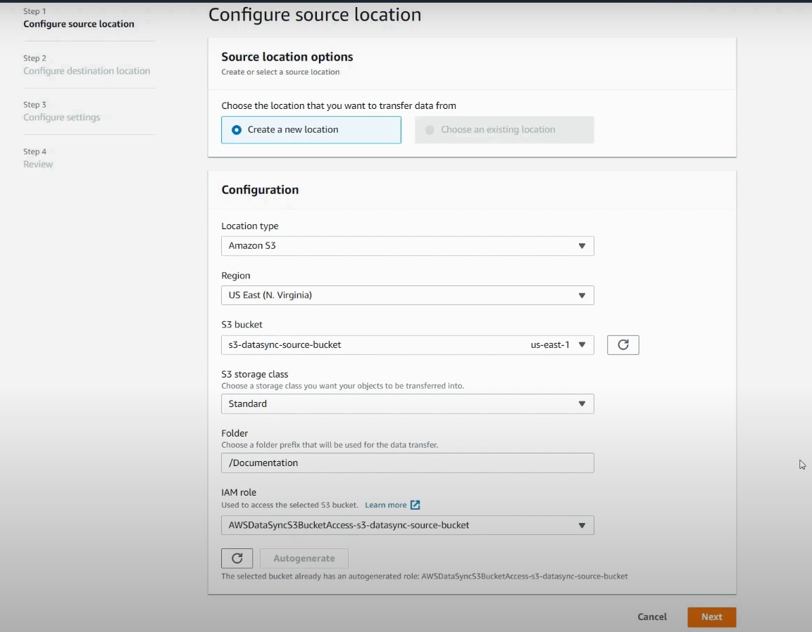
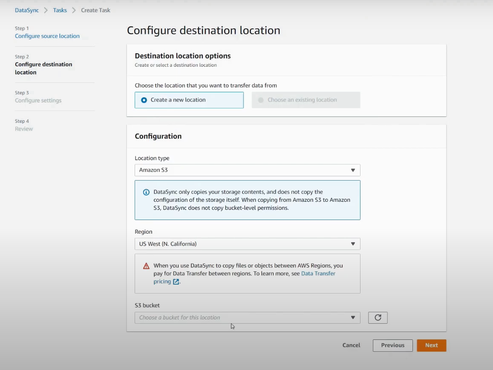
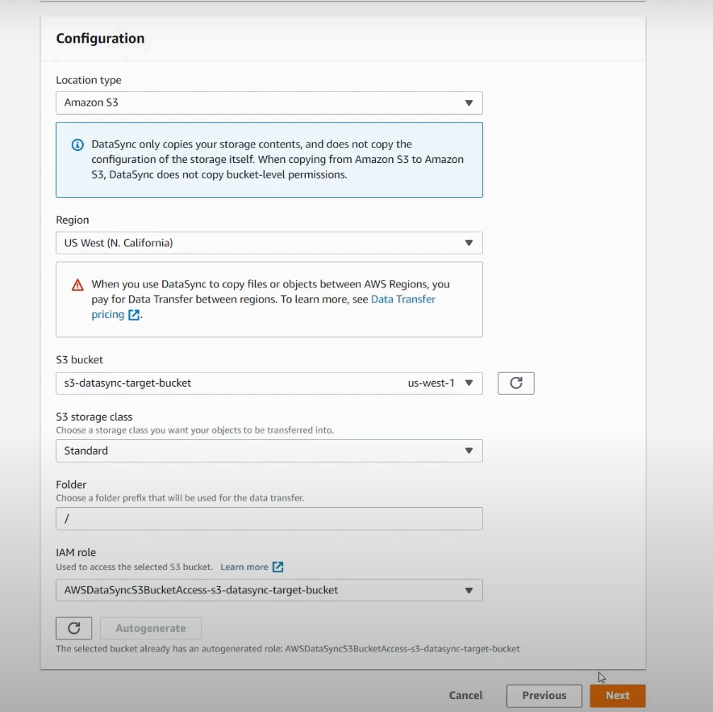
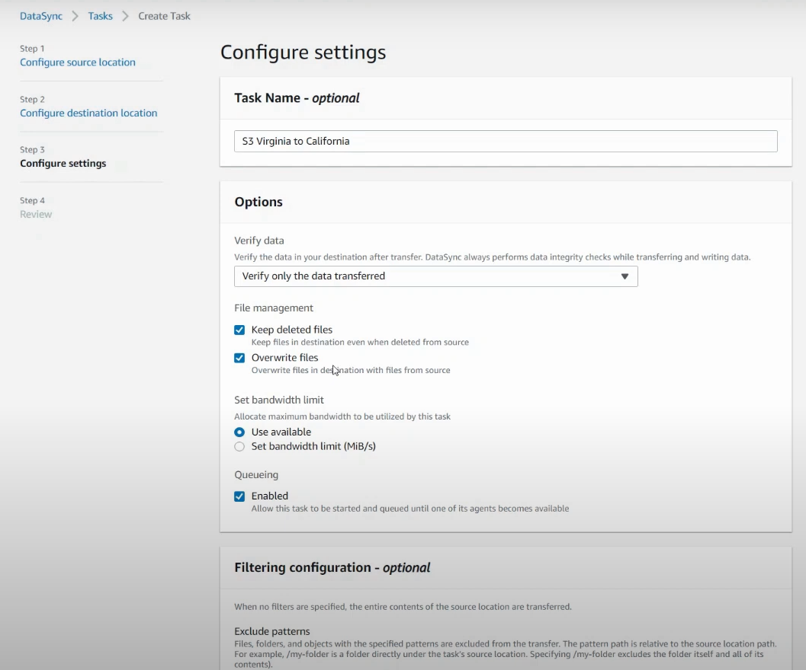
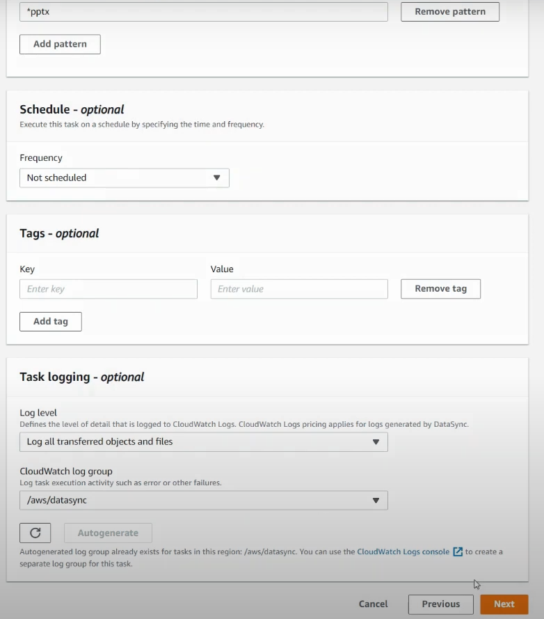
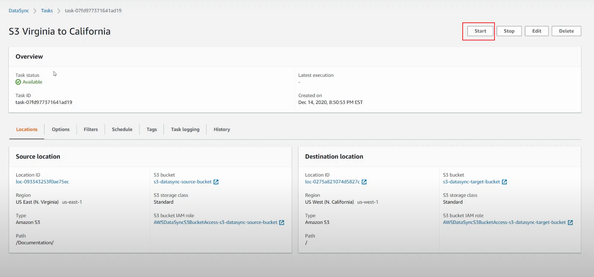
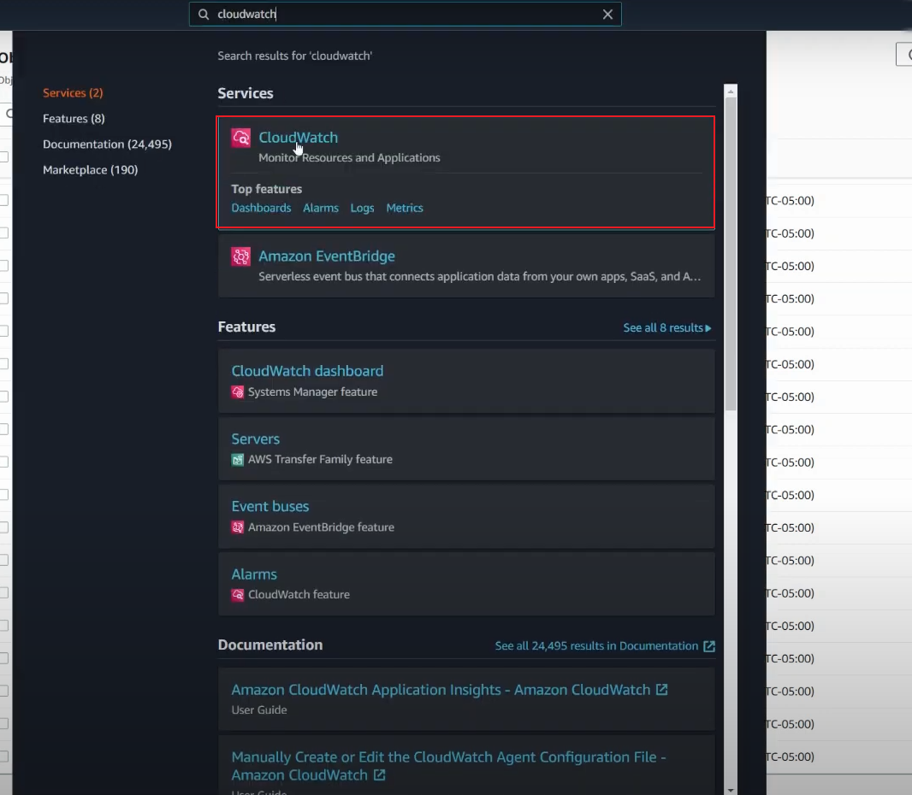
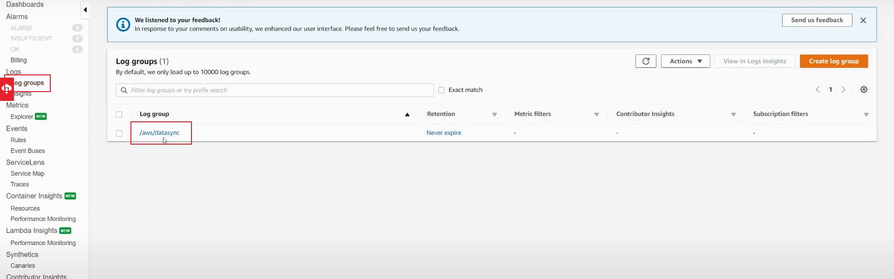

# 创建data sync(s3)

**

**将 source bucket 下的/Documentation 同步到 target  bucket下**

**

## 1.source configuration

## 2. target configuration

## 3.Configuration settings

## 4. Success

## 5.CloudWatch 查看日志

